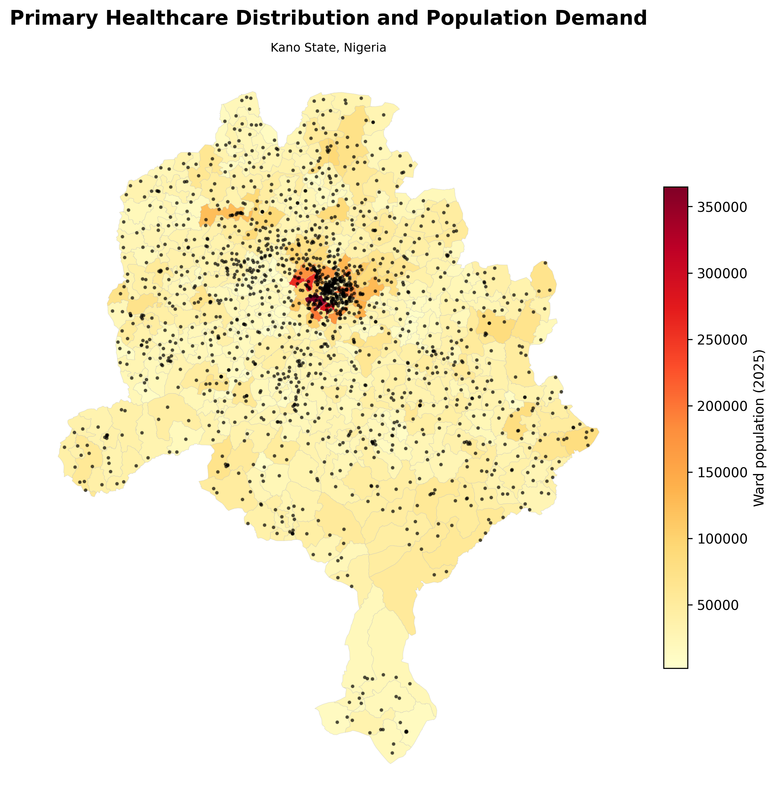
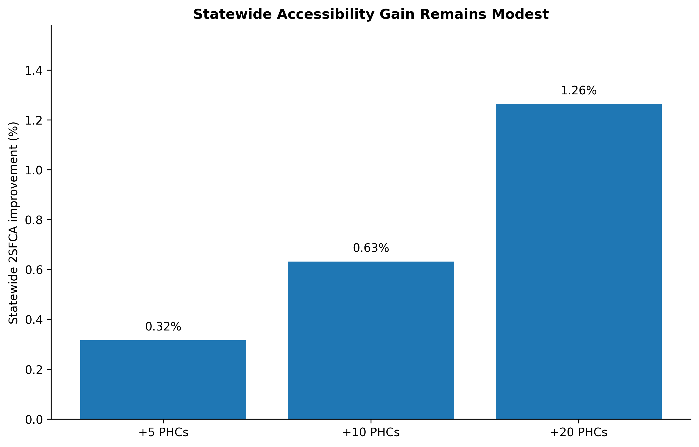
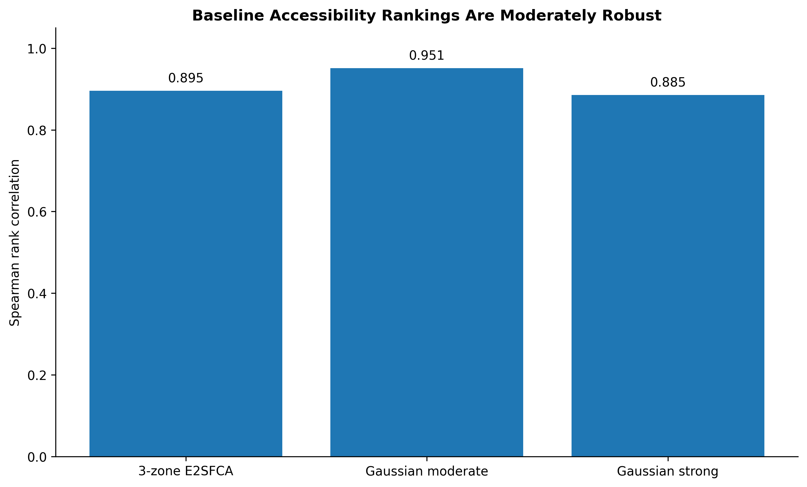
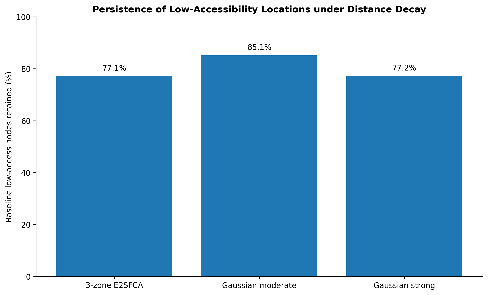

# Primary Healthcare Accessibility and Underservice in Kano State, Nigeria

 


 

## Overview

 

This project examines primary healthcare accessibility across Kano State, Nigeria. It combines population data, primary healthcare facility locations and road-network travel time with a 15-minute two-step floating catchment area (2SFCA) analysis.

 

The study asks two main questions:

 

1. Where are the main gaps in primary healthcare access across Kano State?

2. How much could carefully selected new PHC locations improve access?

 

The analysis covers **1,584 PHCs**, **484 wards** and **16,789 population-demand cells**.

 

---

 

## Why this matters

 

Being close to a health facility does not always mean that access is adequate. A nearby PHC may still serve a very large surrounding population.

 

This project therefore considers both:

 

- travel time to PHCs;

- the number of facilities available relative to surrounding population demand.

 

The result is a clearer picture of where PHC access is relatively strong and where communities may still face spatial underservice.

 

---

 

## Research question

 

**Where are the main gaps in primary healthcare access across Kano State, and how much could carefully selected new PHC locations improve access?**

 

---

 

## Method

 

The analysis followed these main steps:

 

1. Measured road-network travel time from population locations to the nearest PHC.

2. Calculated a 15-minute 2SFCA accessibility score.

3. Summarised accessibility at ward level.

4. Identified wards with multiple access problems.

5. Created a healthcare planning-priority classification.

6. Assessed **97 possible new PHC locations**.

7. Tested **+5, +10 and +20 PHC expansion scenarios**.

8. Repeated the accessibility analysis using three distance-decay approaches.

9. Reproduced the main expansion and candidate-site results during the final scientific review.

 

The main 2SFCA model uses **facility count as supply**.

 

---

 

## Key findings

 

The baseline population-weighted 2SFCA value was **0.8438 PHCs per 10,000 people**.

 

The tested expansion scenarios produced the following results:

 

| Scenario | Population-weighted 2SFCA |

|---|---:|

| Baseline | 0.8438 |

| +5 PHCs | 0.8465 |

| +10 PHCs | 0.8492 |

| +20 PHCs | 0.8545 |

 

Adding the top 20 proposed PHCs increased the statewide population-weighted 2SFCA value by only **1.26%**.

 

About **687,356 people**, or approximately **3.66% of the state population**, experienced some improvement in modeled accessibility under the +20 PHC scenario.

 

The +10 scenario improved modeled access for about **556,701 people**, but the final review does not treat +10 as a preferred statewide solution. The wider conclusion is that carefully placed facilities can help selected underserved communities, while facility expansion alone produces only a modest statewide change.

 

---

 

# Final validated maps

 

## 1. PHC distribution and population demand

 



 

Shows the spatial distribution of PHCs against ward population demand.

 

---

 

## 2. Network travel time to the nearest PHC

 


 

Shows modeled road-network travel time from population-demand locations to the nearest PHC.

 

---

 

## 3. 15-minute 2SFCA healthcare accessibility

 


 

Shows modeled spatial availability based on facility count and population demand.

 

---

 

## 4. Multi-dimensional underserved wards

 


 

Highlights wards where several accessibility problems occur together.

 

---

 

## 5. Healthcare planning-priority wards

 


 

Shows the wards that require greater attention when planning future PHC investment.

 

---

 

## 6. Validated PHC expansion scenarios

 


 

Compares the baseline, +5, +10 and +20 PHC scenarios using the validated accessibility results.

 

---

 

## 7. Verified top-20 new PHC candidate sites

 


 

Shows the 20 highest-ranked candidate intervention locations from the 97 sites assessed.

 

These locations are planning options, not confirmed facility locations.

 

---

 

# Final validated charts

 

## 1. Statewide 2SFCA expansion

 


 

Shows the population-weighted 2SFCA values under the baseline, +5, +10 and +20 scenarios.

 

---

 

## 2. Relative statewide accessibility gain

 



 

Shows how the percentage gain increases as additional PHCs are introduced.

 

---

 

## 3. Population benefiting from expansion

 


 

Shows the estimated population experiencing some improvement under each tested expansion scenario.

 

---

 

## 4. Distance-decay sensitivity

 


 

Checks whether the expansion conclusion changes when longer travel times receive less weight.

 

---

 

## 5. Accessibility rank stability

 



 

Shows how strongly local accessibility rankings remain related across alternative distance-decay assumptions.

 

---

 

## 6. Low-access classification stability

 



 

Shows how many low-access locations remain classified as low access under alternative decay specifications.

 

---

 

# Data and supporting results

 

The repository includes the main validated result tables in:

 

[`data/core_results`](data/core_results/)

 

Important tables include:

 

- `Kano_Validated_Headline_Findings.csv`

- `Kano_Validated_Expansion_Scenario_Summary.csv`

- `Kano_Ward_2SFCA_15min.csv`

- `Kano_New_PHC_Candidate_Sites.csv`

- `Kano_Validated_New_PHC_Catchments.csv`

- `Kano_Validated_Distance_Decay_Method_Comparison.csv`

 

The distance-decay and sensitivity results are available in:

 

[`data/sensitivity`](data/sensitivity/)

 

These files allow reviewers to inspect the results behind the sensitivity analysis rather than relying only on the figures.

 

---

 

# Validation

 

The final review checked the main results used in the project.

 

The validation work included:

 

- reproduction of all **20 candidate-site catchments** within numerical tolerance;

- reproduction of all **4 binary expansion scenarios** within numerical tolerance;

- consistency checks between authoritative tables and reported headline values;

- validation of all final charts;

- validation of all final maps;

- structural and narrative checks of the final report;

- review of the final project board;

- distance-decay sensitivity analysis.

 

Selected validation evidence is available in:

 

[`validation`](validation/)

 

The reviewer action register is also included so that the main corrections made during the final review can be inspected.

 

---

 

# Distance-decay interpretation

 

The broad accessibility pattern remained reasonably stable under alternative distance-decay assumptions, although some local rankings changed.

 

This means the project should place more emphasis on **persistent underserved areas** than on exact local ranking positions.

 

The main expansion conclusion also remained the same: adding new PHCs can improve access in selected communities, but the statewide improvement remains modest.

 

---

 

# Planning meaning

 

The analysis suggests that new PHCs should be targeted at specific underserved communities rather than treated as a complete statewide solution.

 

Facility location is only one part of healthcare access.

 

Future planning would benefit from information on:

 

- staffing;

- equipment;

- facility capacity;

- service volume;

- healthcare utilisation.

 

---

 

# Important limitation

 

The project does not contain facility staffing, bed capacity, service-volume, HMIS or patient-utilisation data.

 

For this reason, the 2SFCA results measure **modeled spatial availability**.

 

They do **not** measure:

 

- actual healthcare quality;

- realised facility capacity;

- staffing adequacy;

- actual patient utilisation;

- health outcomes.

 

This distinction is important when interpreting the results.

 

---

 

# Final technical report

 

The full validated technical report is available in:

 

[`report`](report/)

 

The report contains the full methodology, results, maps, charts, interpretation, validation and limitations.

 

---

 

# Project board

 

The refined final project board is used as the main project cover:

 


 

A copy prepared for repository sharing is also stored in:

 

[`assets/social_preview/repository-social-preview.png`](assets/social_preview/repository-social-preview.png)

 

---

 

# Repository structure

 

```text

.

├── README.md

├── assets

│   ├── project_cover

│   │   └── kano_phc_accessibility_project_cover.png

│   ├── social_preview

│   │   └── repository-social-preview.png

│   ├── maps

│   │   ├── 01_PHC_Distribution_and_Population_Demand.png

│   │   ├── 02_Network_Travel_Time_to_Nearest_PHC.png

│   │   ├── 03_Validated_15min_2SFCA_Healthcare_Accessibility.png

│   │   ├── 04_Multi_Dimensional_Underserved_Wards.png

│   │   ├── 05_Healthcare_Planning_Priority_Wards.png

│   │   ├── 06_Validated_PHC_Expansion_Scenarios.png

│   │   └── 07_Validated_Top20_New_PHC_Candidate_Sites.png

│   └── charts

│       ├── 01_Validated_Statewide_2SFCA_Expansion.png

│       ├── 02_Validated_Statewide_2SFCA_Relative_Gain.png

│       ├── 03_Validated_Population_Benefiting_From_Expansion.png

│       ├── 04_Validated_Distance_Decay_Sensitivity.png

│       ├── 05_Validated_Distance_Decay_Rank_Stability.png

│       └── 06_Validated_Low_Access_Classification_Stability.png

├── data

│   ├── core_results

│   └── sensitivity

├── docs

├── report

└── validation

```

 

---

 

# Tools

 

- Python

- GeoPandas

- NetworkX

- GIS

- road-network analysis

- 2SFCA accessibility modelling

- Pandas

- Matplotlib

 

---

 

# Author

 

**Abdullah Abdazeez Ayomide**

 

Geo-spatial Planner | GIS and Remote Sensing Analyst | Environmental and Urban Planning Researcher

