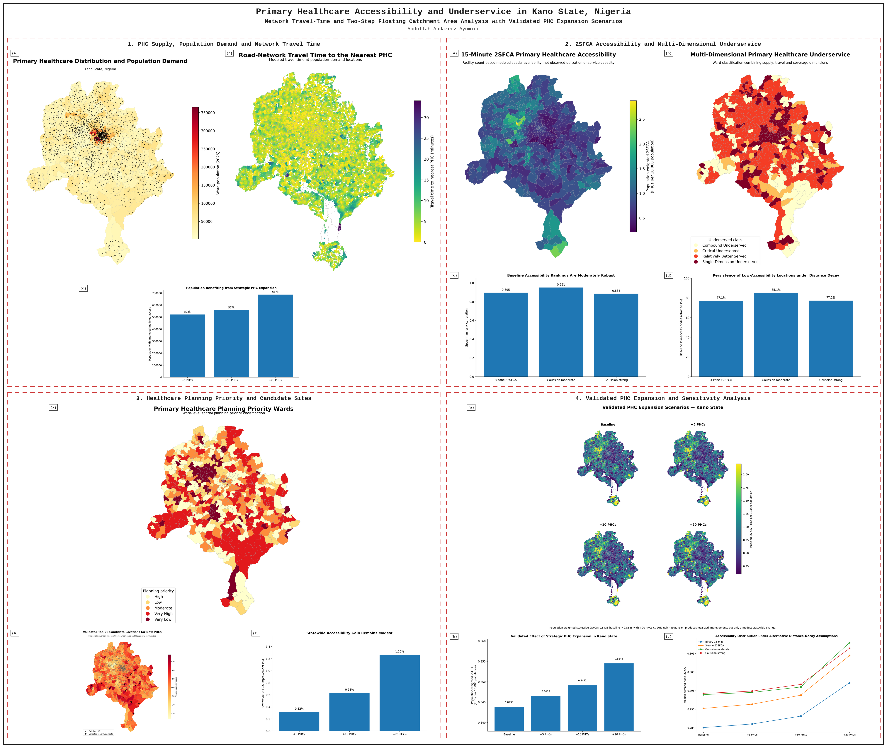
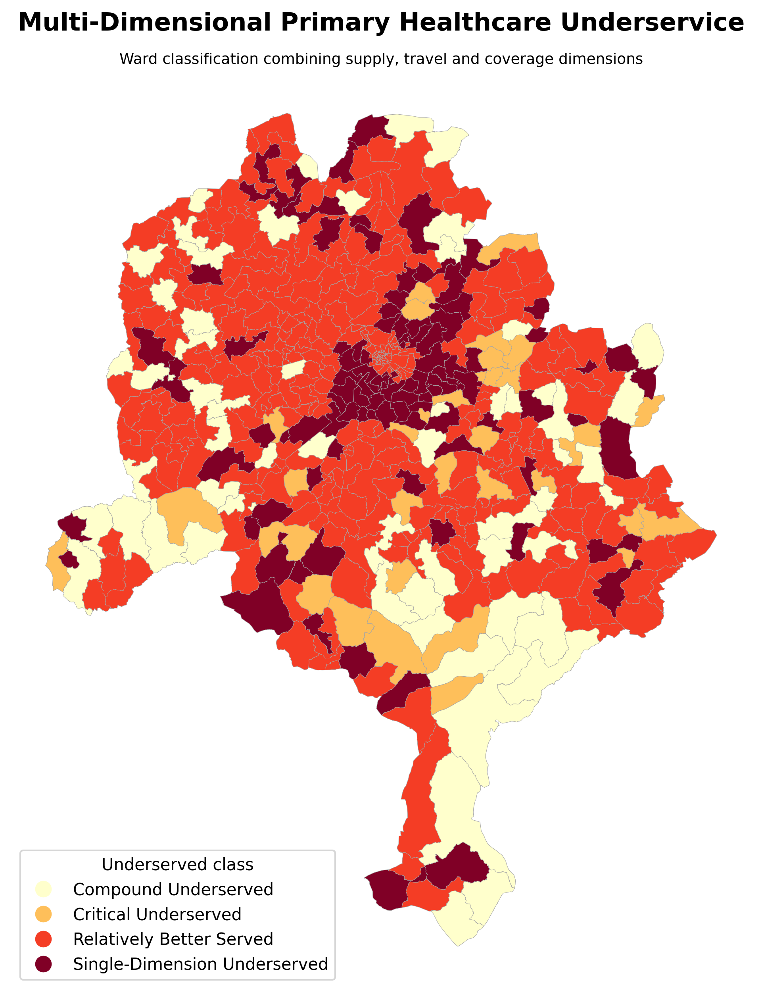
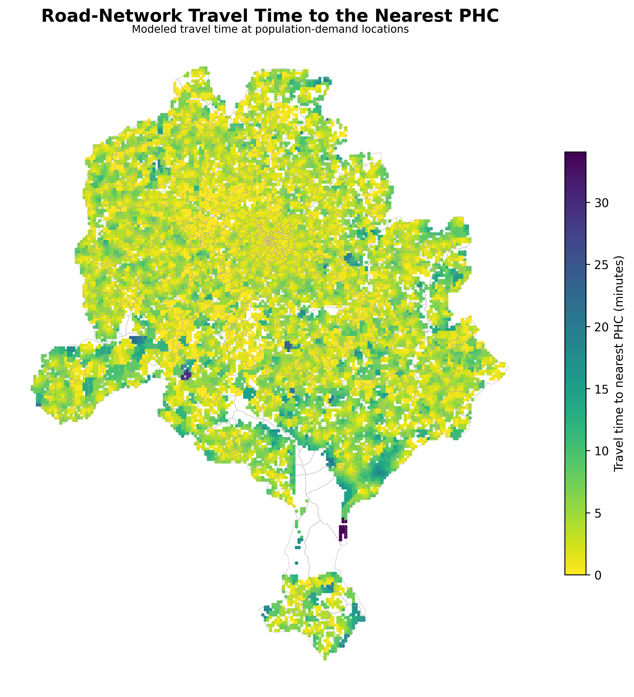
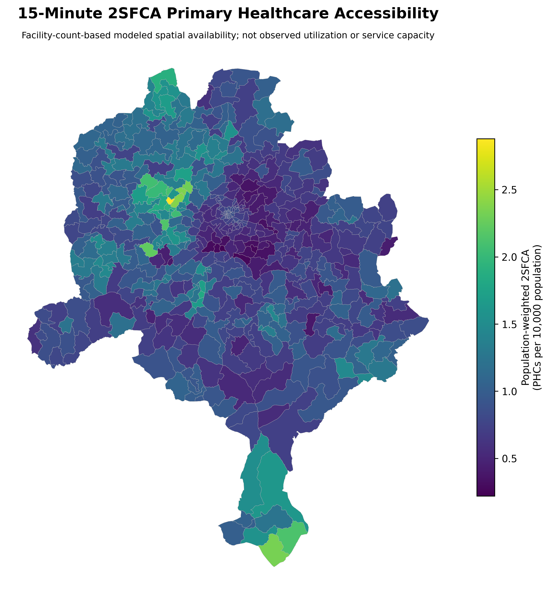
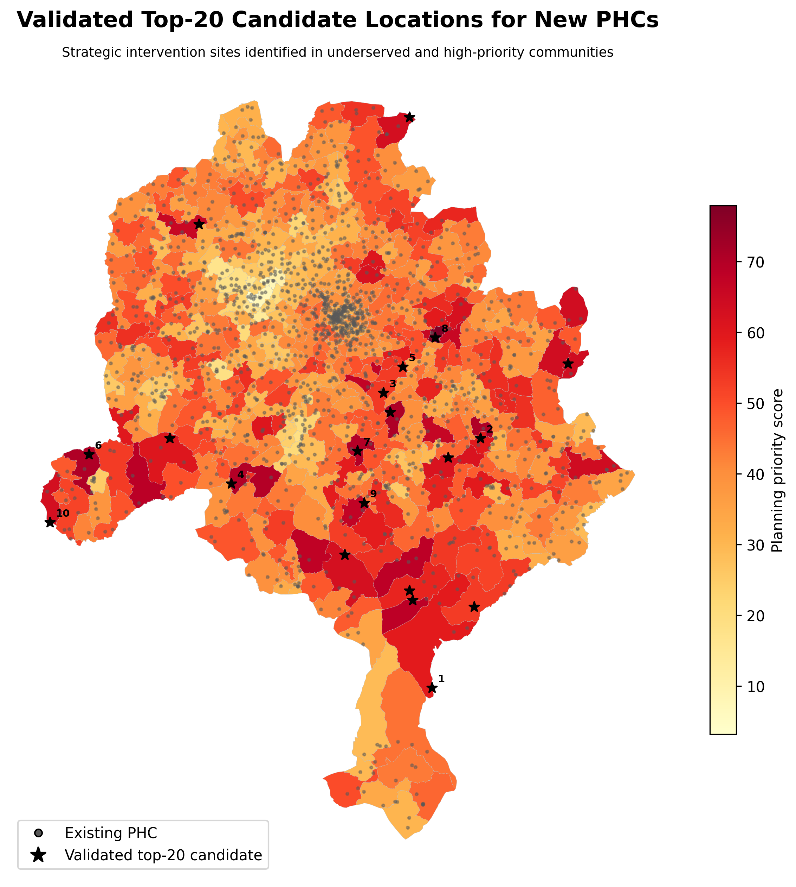
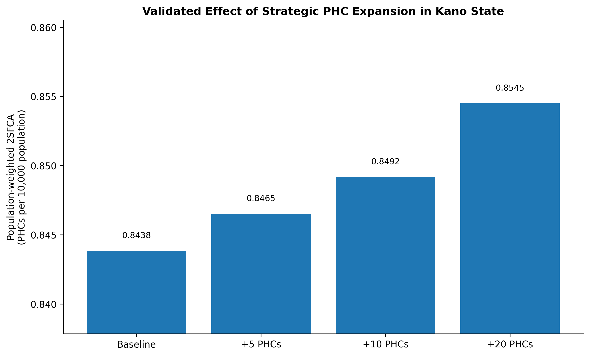

# Primary Healthcare Accessibility in Kano State, Nigeria

  

## What this project asks

Where are the main gaps in primary healthcare access across Kano State, and how much could carefully placed new PHCs improve the situation?

I combined road-network travel time, population demand and a **15-minute two-step floating catchment area (2SFCA)** analysis. The final dataset covers **1,584 PHCs, 484 wards and 16,789 population-demand cells**.

I also tested **97 possible new PHC locations** and compared +5, +10 and +20 facility scenarios.

## Why distance alone is not enough

A nearby facility can still be overstretched if it serves a very large surrounding population. For that reason, I looked at both travel time and the number of PHCs available relative to population demand.

The result is a more useful planning picture than simply drawing buffers around facilities.

## Main findings

| Scenario | Population-weighted 2SFCA |
|---|---:|
| Baseline | **0.8438** |
| +5 PHCs | **0.8465** |
| +10 PHCs | **0.8492** |
| +20 PHCs | **0.8545** |

The +20 scenario increased the statewide population-weighted 2SFCA value by only **1.26%**. Around **687,356 people (3.66%)** experienced some improvement in modelled accessibility.

That is an important planning result: **new facilities can make a real difference in selected underserved communities, but adding PHCs alone does not transform statewide access.**

## Where the gaps are

  

The underserved-ward analysis combines several access problems rather than relying on one indicator. This helps distinguish places that are repeatedly disadvantaged across different parts of the model.

  

The planning-priority map translates those gaps into a clearer screening layer for future PHC investment.

## Travel time and spatial availability

  

  

The two maps answer different questions. Travel time shows how quickly a population location can reach a PHC. The 2SFCA surface adds the pressure of surrounding population demand to that picture.

## Testing new PHC locations

  

The 20 locations shown above are **planning candidates, not approved facility sites**. They were selected from 97 tested locations using the modelled accessibility evidence.

  

The statewide change is modest even as more facilities are added. This is why I do not present the +10 or +20 scenario as a complete solution. The more useful lesson is to target expansion carefully and combine it with information about service capacity and quality.

## How I built the analysis

1. Measured road-network travel time from population-demand locations to existing PHCs.
2. Calculated a 15-minute 2SFCA accessibility score using facility count as the supply measure.
3. Summarised the results at ward level.
4. Identified places where several access problems overlap.
5. Built a healthcare planning-priority classification.
6. Evaluated 97 possible new PHC locations.
7. Tested +5, +10 and +20 PHC scenarios.
8. Repeated the analysis with alternative distance-decay assumptions.
9. Reproduced the final candidate catchments and expansion results during the validation review.

## Sensitivity and validation

The final review reproduced all **20 selected candidate-site catchments** and all **4 binary expansion scenarios** within numerical tolerance. I also checked the headline values against the authoritative tables and tested whether the conclusions changed under alternative distance-decay assumptions.

The broad pattern remained stable, although some local rankings moved. That is why the project gives more weight to **persistent underserved areas** than to small differences in exact rank.

Validation material is available in [`validation`](validation/), while the main result tables are in [`data/core_results`](data/core_results/).

## What this means for planning

The analysis supports targeted PHC expansion, but it also shows the limit of location-only planning. Facility access depends on much more than whether a building exists nearby.

A stronger next-stage assessment would include staffing, equipment, opening hours, service volume, patient utilisation and facility capacity. Those variables are not available in this project, so the 2SFCA result should be read as **modelled spatial availability**, not healthcare quality.

## Full outputs

All seven final maps are available in [`assets/maps`](assets/maps/), and the analytical charts are in [`assets/charts`](assets/charts/). The final technical report is stored in [`report`](report/).

## Tools

Python · GeoPandas · NetworkX · Pandas · Matplotlib · GIS · Road-network analysis · 2SFCA accessibility modelling

## Author

**Abdullah Abdazeez Ayomide**  
Geospatial Planner · GIS & Remote Sensing Analyst · Urban & Environmental Planning Researcher

[GitHub](https://github.com/Abdullahabdazeez) · [LinkedIn](https://ng.linkedin.com/in/abdazeez-abdullah-4b814719a)

## Citation and licence

Citation metadata is provided in [`CITATION.cff`](CITATION.cff). External datasets remain subject to their original providers' terms.
