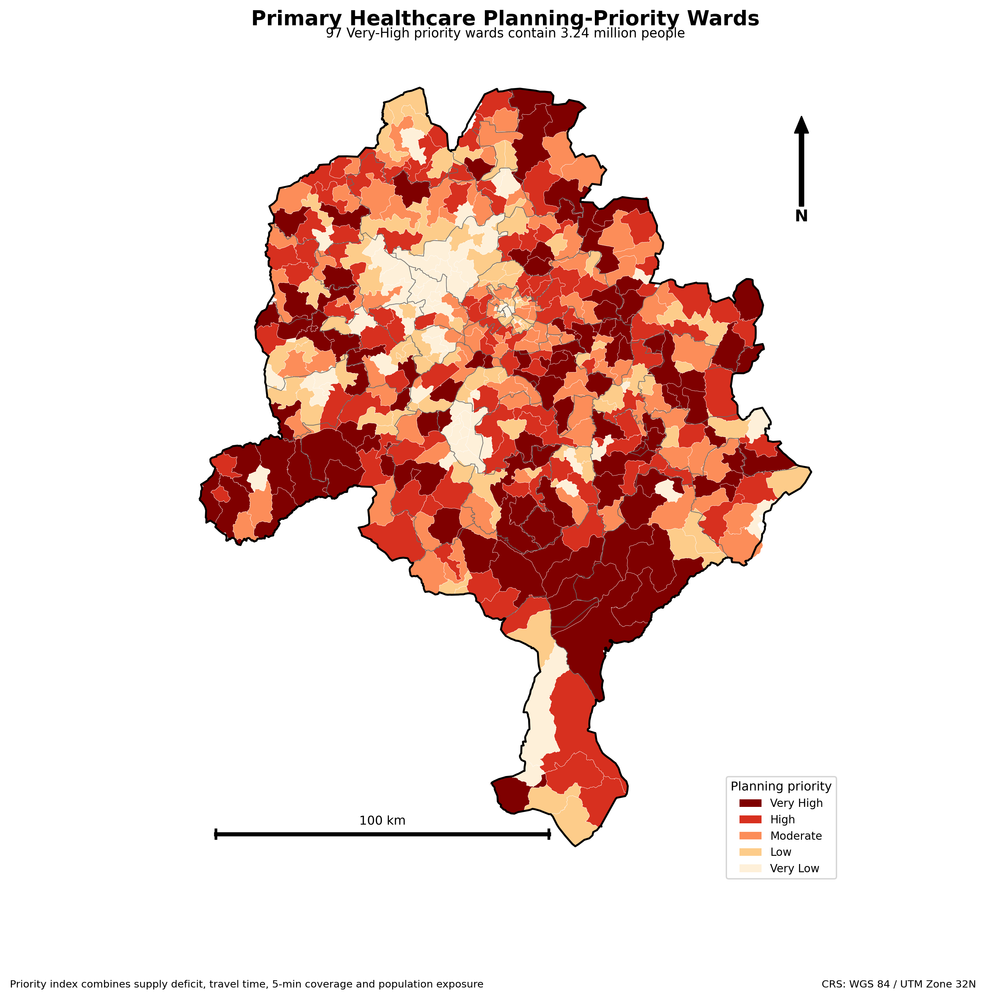
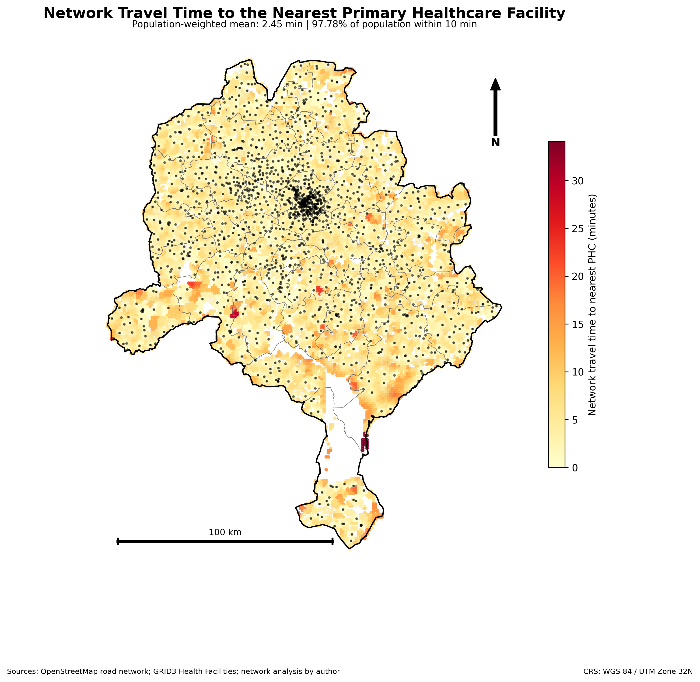
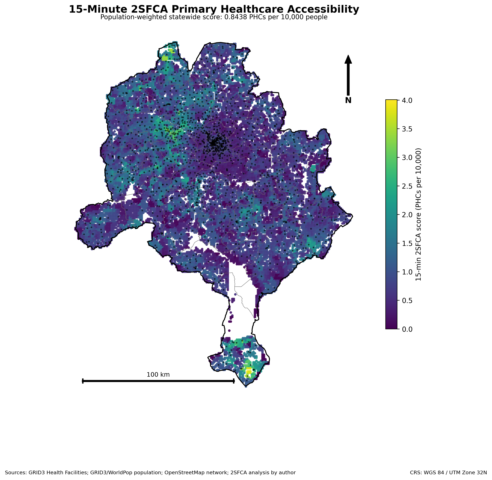
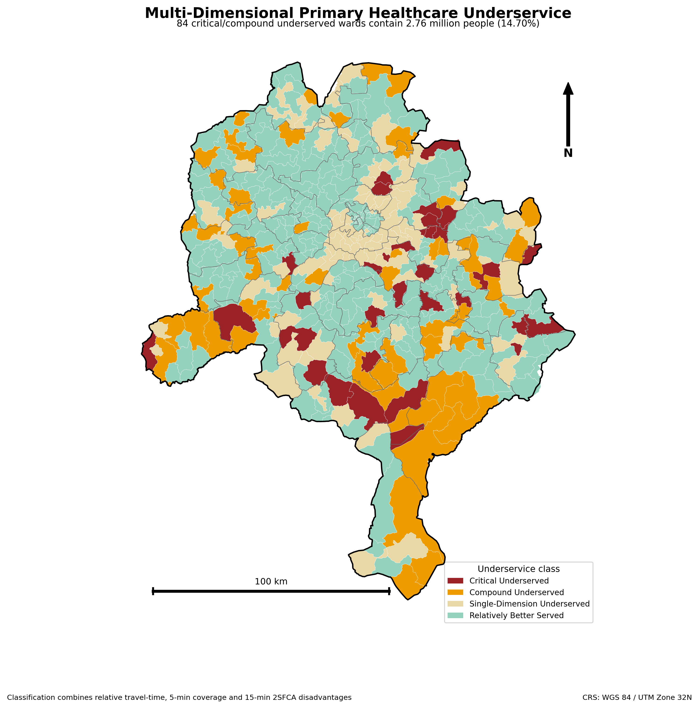
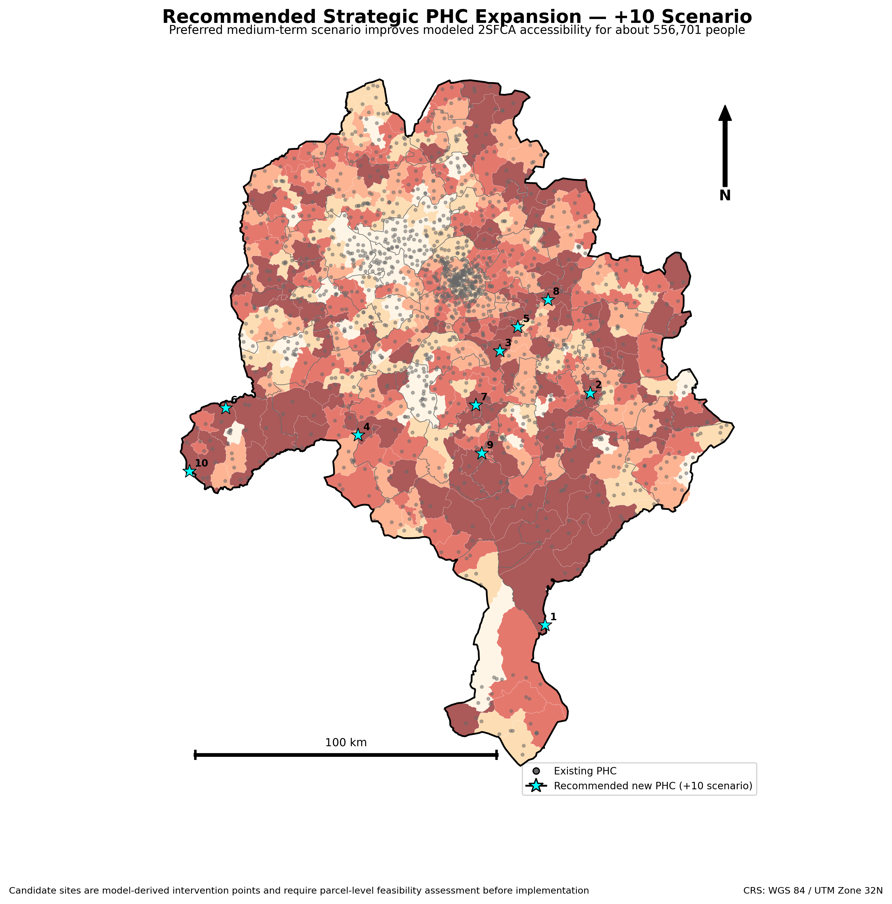

# Spatial Accessibility and Equity of Primary Healthcare Services in Kano State, Nigeria

**Network-based assessment of travel-time access, healthcare supply, underserved wards and strategic PHC expansion across Kano State.**

<p align="center">
  
</p>

Kano has a large primary healthcare network, but proximity to a facility does not necessarily mean that healthcare supply is equitable. This project combined validated PHC locations, gridded population demand, operational ward boundaries and an OpenStreetMap road network to evaluate both travel time and population-adjusted service availability.

Multi-source shortest-path analysis estimated access to the nearest PHC, while a 15-minute Two-Step Floating Catchment Area model compared facility supply with surrounding population demand. The results show that **97.78% of the population is within 10 minutes of a PHC**, yet the statewide population-weighted 2SFCA score is only **0.8438 PHCs per 10,000 people**. This contrast demonstrates that physical proximity alone can conceal substantial differences in service pressure.

The analysis identified **84 critical or compound underserved wards**, containing approximately **2.76 million people**, and classified **97 wards as very-high planning priorities**. A strategic scenario adding ten PHCs improved modelled 2SFCA access for approximately **556,701 people**. These candidate sites are planning-support locations rather than parcel-level construction recommendations.

| Project detail | Information |
|---|---|
| **Study area** | Kano State, Nigeria |
| **Population analysed** | 18,771,134 |
| **Primary healthcare facilities** | 1,584 |
| **Administrative units** | 44 LGAs and 484 operational wards |
| **Demand origins** | 16,789 one-kilometre population cells |
| **Access methods** | Shortest-path travel time and 15-minute 2SFCA |
| **Planning outputs** | Underserved typology, priority ranking and +10 PHC scenario |

## Key findings

- Population-weighted nearest-PHC travel time was **2.45 minutes**.
- **86.41%**, **97.78%** and **99.67%** of the population were within 5, 10 and 15 minutes of a PHC respectively.
- Population-weighted healthcare supply was **0.8438 PHCs per 10,000 people**.
- **29 wards** were classified as critically underserved.
- **84 critical or compound underserved wards** contained **2,759,236 people**, representing **14.70%** of the study population.
- **97 wards** were classified as very-high planning priorities.
- Yangizo Ward in Warawa recorded the highest planning-priority score: **77.88/100**.
- Dawakin Kudu recorded the lowest LGA-level 2SFCA accessibility: **0.4615 PHCs per 10,000 people**.
- The preferred +10 PHC scenario improved modelled 2SFCA access for **556,701 people**.

## Analytical workflow

1. Harmonised Kano State, LGA and operational ward boundaries.
2. Validated and projected PHC facility locations.
3. Prepared a one-kilometre population-demand grid.
4. Extracted and attributed the OpenStreetMap drive network using road-class speed assumptions.
5. Calculated multi-source shortest-path travel time to the nearest PHC.
6. Estimated population-weighted access within 5-, 10- and 15-minute thresholds.
7. Applied a 15-minute Two-Step Floating Catchment Area model.
8. Classified multi-dimensional underserved wards.
9. Combined travel time, supply accessibility and population exposure into a planning-priority index.
10. tested strategic PHC expansion scenarios and selected the +10 facility option for detailed mapping.

## Data sources

| Dataset | Provider | Purpose |
|---|---|---|
| Health facilities | GRID3 Nigeria Health Facilities v2.0 | Validated PHC supply locations |
| Population | GRID3 / WorldPop Nigeria Population v3.0 | Gridded demand and administrative totals |
| Administrative boundaries | GRID3 operational boundaries | State, LGA and ward reporting |
| Road network | OpenStreetMap | Network-based travel-time modelling |

## Principal outputs

### Travel time to the nearest PHC



### 15-minute 2SFCA healthcare accessibility



### Multi-dimensional underserved wards



### Recommended ten-PHC expansion scenario



## Planning interpretation

The project distinguishes **geographic proximity** from **population-adjusted service accessibility**. Although most residents are close to a PHC in travel-time terms, several wards combine high population pressure, comparatively low facility supply and weaker access outcomes. Those wards require more attention than a simple nearest-facility map would indicate.

The priority and underserved classes are relative analytical classes derived from the Kano study distribution; they are not official Nigerian service standards. Candidate facilities are strategic accessibility-intervention points and require parcel-level feasibility, land ownership, service quality, staffing, financing and community consultation before implementation.

## Repository structure

```text
.
├── assets/                  # Project cover and social preview
├── data/processed/
│   ├── gis/                 # Selected final GIS layers
│   └── tables/              # Results, rankings and scenario tables
├── docs/                    # Methodology, data, results and limitations
├── notebooks/               # Results-review notebook
├── outputs/
│   ├── maps/                # Six final planning maps
│   └── charts/              # Seven analytical charts
├── scripts/python/          # Summary reproduction script
├── validation/              # Automated repository checks
├── CITATION.cff
├── LICENSE
├── README.md
├── project.json
└── requirements.txt
```

## Reproducibility

This repository publishes the final analytical evidence and a results-reproduction script. The complete road-network computation is not included because the source graph files are large and depend on a time-specific OpenStreetMap snapshot. The methodology document records the analytical sequence, assumptions and interpretation limits.

Run:

```bash
pip install -r requirements.txt
python scripts/python/reproduce_summary.py
python validation/validate_repository.py
```

## Author

**Abdullah Abdazeez Ayomide**  
Geo-spatial Planner | GIS & Remote Sensing Analyst

- [GitHub](https://github.com/Abdullahabdazeez)
- [LinkedIn](https://ng.linkedin.com/in/abdazeez-abdullah-4b814719a)
- [Email](mailto:abdazeezabdullah1@gmail.com)

## Citation and licence

Citation metadata is provided in [`CITATION.cff`](CITATION.cff). Code and original repository documentation are released under the MIT License. External datasets retain their providers' original licences and terms.
