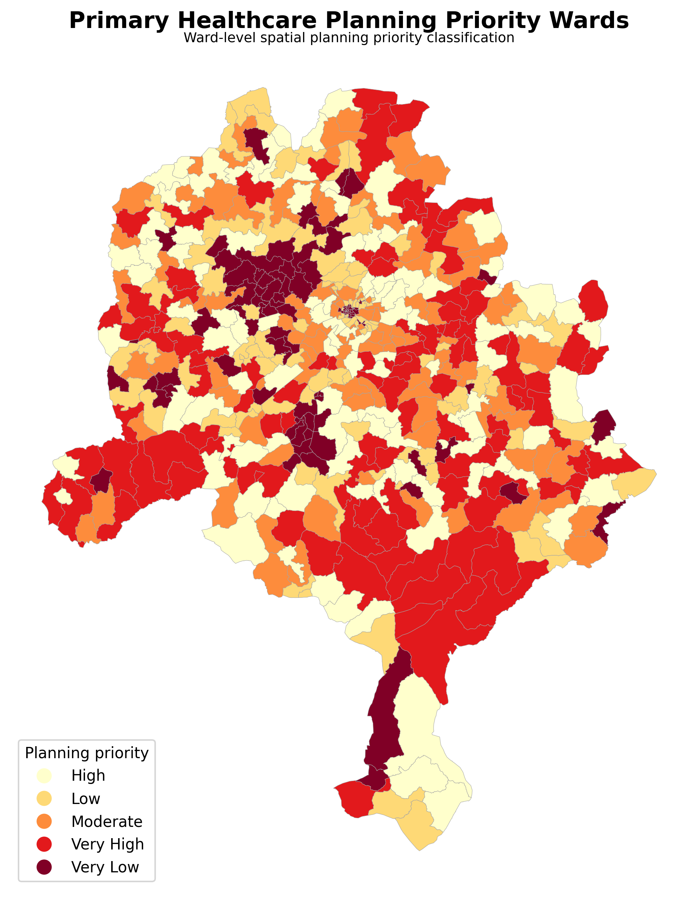
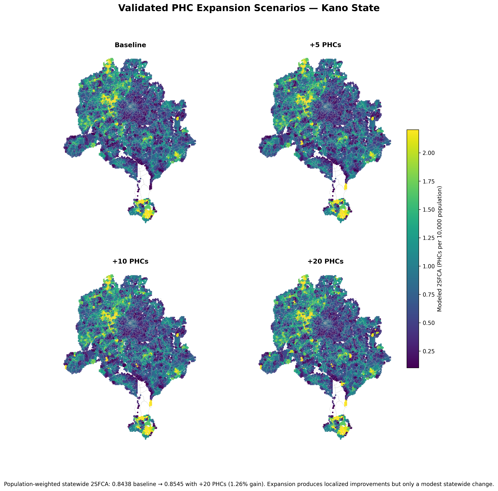
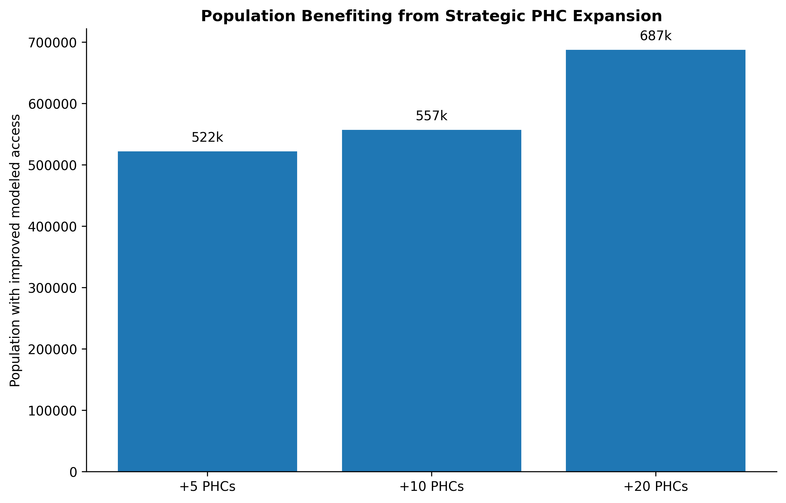
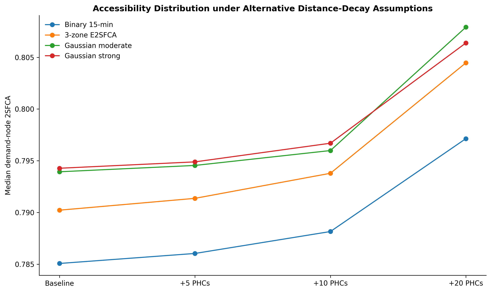

# Primary Healthcare Accessibility and Underservice in Kano State, Nigeria


## Overview

This project examines primary healthcare access across Kano State, Nigeria. It combines population data, PHC locations and road-network travel time with a 15-minute two-step floating catchment area (2SFCA) analysis.

The study asks two simple questions:

1. Where are the main gaps in primary healthcare access across Kano State?
2. How much could carefully selected new PHC locations improve access?

The analysis covers **1,584 PHCs**, **484 wards** and **16,789 population-demand cells**.

---

## Why this matters

Being close to a health facility does not always mean that access is adequate. A nearby PHC may serve a very large population, which can reduce the amount of facility supply available to each community.

This project therefore looks at both travel time and population demand.

---

## Data

| Dataset | Purpose |
|---|---|
| Primary healthcare facilities | Existing PHC locations |
| Ward population | Population demand |
| Road network | Travel-time modelling |
| Demand cells | Population-based accessibility analysis |
| Ward boundaries | Ward-level summaries |
| Candidate PHC sites | Expansion scenario testing |

---

## Method

The analysis followed these steps:

1. Measured road-network travel time from population locations to the nearest PHC.
2. Calculated a 15-minute 2SFCA accessibility score.
3. Summarised accessibility at ward level.
4. Identified underserved wards.
5. Created a healthcare planning-priority classification.
6. Assessed 97 possible locations for new PHCs.
7. Tested +5, +10 and +20 PHC expansion scenarios.
8. Repeated the accessibility analysis with three distance-decay methods to check whether the main findings changed.

The main 2SFCA model uses **facility count as supply**.

---

## Key findings

The baseline population-weighted 2SFCA score was **0.8438 PHCs per 10,000 people**.

Adding the top 20 proposed PHCs increased this to **0.8545**, a statewide increase of only **1.26%**.

About **687,356 people** experienced some improvement in modeled access under the +20 PHC scenario. This represents about **3.66% of the state population**.

The result suggests that new PHCs can improve access in selected underserved communities, but facility expansion alone produces only a small statewide change.

---

## Main maps

### 1. 15-minute 2SFCA accessibility


This map shows modeled spatial availability of PHCs relative to population demand.

### 2. Multi-dimensional underservice


This map identifies wards where several access problems occur together.

### 3. Healthcare planning priority



The planning-priority map highlights wards that may require closer attention when planning future PHC investment.

### 4. PHC expansion scenarios



The baseline, +5, +10 and +20 PHC scenarios show where new facilities improve modeled access.

### 5. Top-20 candidate locations


These are the 20 highest-ranked candidate locations from the 97 sites assessed. They are planning options, not confirmed facility locations.

---

## Expansion results


The statewide change remains small even as more PHCs are added.



The expansion scenarios still provide useful local benefits for some underserved communities.

---

## Distance-decay check



The analysis was repeated with three distance-decay methods.

The broad pattern remained similar, although some local rankings changed when longer travel times were given less weight. The +20 PHC scenario still produced only a small statewide improvement.

---

## Planning meaning

The results suggest that future PHC investment should be targeted at specific underserved communities rather than treated as a complete solution to healthcare access across Kano State.

Facility location is only one part of the problem. Staffing, equipment, service capacity and actual healthcare use also matter.

---

## Important limitation

The project does not contain facility staffing, bed capacity, service-volume, HMIS or healthcare-use data.

For this reason, the 2SFCA results measure **modeled spatial availability**. They do **not** measure actual service quality, facility capacity or patient use.

---

## Validation

The final scientific review:

- reproduced all **20 candidate-site catchments** within numerical tolerance;
- reproduced all **4 binary expansion scenarios** within numerical tolerance;
- tested the results with three distance-decay approaches;
- checked that the main conclusion remained stable;
- documented the lack of external healthcare-utilization data.

The validated numerical tables are available in the [`data`](data/) folder.

---

## Repository structure

```text
.
├── README.md
├── assets
│   ├── project_cover
│   │   └── kano_phc_accessibility_project_cover.png
│   ├── maps
│   │   ├── 01_2sfca_accessibility.png
│   │   ├── 02_underserved_wards.png
│   │   ├── 03_planning_priority_wards.png
│   │   ├── 04_phc_expansion_scenarios.png
│   │   └── 05_top20_candidate_sites.png
│   └── charts
│       ├── 01_statewide_2sfca_expansion.png
│       ├── 02_population_benefiting.png
│       └── 03_distance_decay_sensitivity.png
├── data
│   ├── validated_headline_findings.csv
│   ├── validated_expansion_scenarios.csv
│   └── validated_distance_decay_results.csv
└── validation
    ├── numerical_consistency_check.csv
    └── reviewer_action_register.csv
```

---

## Tools

- Python
- GeoPandas
- NetworkX / road-network analysis
- GIS
- 2SFCA accessibility modelling
- Matplotlib
- Pandas

---

## Author

**Abdullah Abdazeez Ayomide**

Geo-spatial Planner | GIS and Remote Sensing Analyst | Environmental and Urban Planning Researcher
